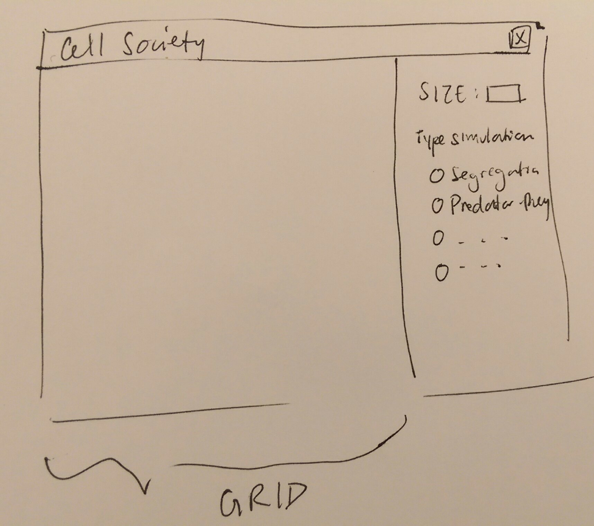

Here is a visual representation of our design overview:

###Introduction
The goal of this project is to create a 2D grid of cells and update them all simultaneously based on a given rule. We expect the user to input the size of the grid , the type of simulation algorithm, and parameters related to those algorithms.

We want a basic cell object that doesn’t waver in function, but is also extensible. We want to extend code that dictates behavior of the cells, as well as code that extracts or bestows cells with certain properties relevant to the simulation.

###Overview

For the basic implementation, we think it is adequate to create abstract classes that reflect core entities that are active in the simulation.

Main class to gather resources via calling to XMLReader and launch the window.
XMLReader to read information from the XML file
Simulation/Rule: an abstract class
Cell: an abstract class, extensible depending on Simulation
possibly a converter class ^^^ for casting to different cell types (down the road)

###User Interface

In the core implementation, we don’t expect the user to input any commands after loading the XML file. The simulation should just run indefinitely as the window containing the cell grid remains open. In later stages, we would want a more advanced GUI that takes in user input dynamically. Something like this:

The grid will be accompanied by a panel of radio buttons that allow the user to update the type of simulation being run. A text field will accept a number representing the square grid dimensions (which in turn dictates the number of cells participating). Bad input should be returned if the user attempts to enter something that’s not a number in the SIZE text field.

In the extended implementation, we would want to provide a more dynamic UI that allows a user to enter in the parameters that certain simulations require (i.e. fire threshold, range of dead/alive in GoL, etc.). Below is a close up hasty sketch of what that might look like, with sliders and text input boxes (will throw error if user inputs non-number):

Here is a visual representation of our GUI:

Here is a closeup on how to parameters on the GUI:

###Design Details
The objective of the Main class is take in input by calling the XMLReader class. Additionally, The Main class will then pass the information parsed (type of simulation, size of grid, etc.) from the XML file into the Game class.

The XMLReader class will simply take in an XML file and parse the contents of it for information pertaining to initializing the simulation. This information could include type of simulation, the size of the grid, and what kinds of “cells” are labeled. This information is then passed into the Main class.

The role of the Main class is to read the information from the XML file that was passed into it by the XMLReader class by calling the XMLReader class and then to pass the information processed by the XMLReader class the into the InitializeSimulator class.  

The InitializeSimulator class creates the initial state of the simulator by taking in the initial states passed from the XMLReader class and to generate the appropriate initial conditions. The InitializeSimulator class then passes the created initial state to the Simulation class via the Main class.

The Loop Simulator will then run indefinitely and “refresh” the simulator state by creating new generations based on the initial condition. Simulation does this by calling the appropriate RuleEnforcer class according to the read in XML file (Fire, Segregation, Predator and Prey, or Game of Life), and each of the associated classes--cells, rule enforcer--inherits the methods defined by the abstract Rules class.

Each specific rules class defines how each cell behaves and changes state throughout time. In order to manipulate the cells on the grid, each RuleEnforcer class calls on their respective cell class to create new cells or change cells.

In the event that the user decides to switch simulations, the Simulation class will then call the convertSimulation method of the SwitchSimulation class to convert between simulations. The convertSimulation will first determine the current simulation and then iterate through all of the Cells in the Grid in order to determine how to convert each Cell of the previous simulation into a Cell of the new simulation. The method will then return a newly converted Grid object full of converted Cell objects, which will then be passed into the Simulation class to update.

##*First use case*

First we need to iterate through the grid using the nextGeneration method found in the Simulation class , which at the moment is tentatively planned as an ArrayList<ArrayList<Cells>>() and then call on the method cells.checkNeighbors() to determine the state of its neighboring cells. If it is determined that a sufficient number of its neighbors are in the dead state, then that cell is set to the dead state for the next generation in the Simulation class.

##*Second use case*

Checking for this case is similar to the first case;however, we instead check to see if a sufficient number of the cell’s neighbor are alive. If so, then the cell is set to the alive state for the next generation.

##*Third use case*

This use case is the sole responsibility of the Simulation class. The Simulation class iterates through each cell of the simulator grid and calls the cell.checkNeighbors() method to determine the state of its neighbors. The Simulation then uses the results of the above method as parameters for the appropriate rules class to then determine the cells’ state for the next generation

##*Fourth use case*

The XMLReader class (which is called by the Main class) parses the given XML file for the probCatch parameter as well as the simulator type and returns both values in the Main class, which are then passed into the InitializeSimulator class. The InitializeSimulator class then uses the simulation type parameter to determine the appropriate initializeState() method to call.  The probCatch parameter is used as an argument for the initializeState() method to create the initial state of the simulation grid.

##*Fifth use case*

The Simulation class will provide code to display the GUI to the user. When the user decides switch simulations, the instance variable boolean switch is set to true, which causes the Simulation class to call the method convertSimulation(Simulation x, Simulation y), where x is the current simulation and y is the simulation we are trying to switch into. The SwitchSimulation class will be found under the Conversion class and will return a Grid object where it will be passed back into the Simulation class. Additionally, the instance variable regarding which simulation is active will be changed to reflect the conversion. The next “generation” produced by the Simulation class will be of the new simulation that the users switches into.

###Design Considerations
Something we are considering is how much responsibility to give our Rule Enforcer classes; we are not sure about whether we are going to have that class in charge of performing actions upon the cells or if we are going to have the different cell methods for each type of simulation and have those perform the actions. We are also considering having the Simulation class take care of the bulk of the actions and just call upon the Rule Enforcer classes to check for rules. We will probably decide this after we see how much code and how extensive each class is, and then put it with the class where it would be the most sensible and useful.

Also, we have an ArrayList of ArrayLists that keeps track of the grid, but we are not sure whether we want to loop through the whole grid the entire time or just keep track of the few cells that we are using and changing. The advantages to reloading whole grid is just it will be easy and consistent, but its disadvantaged in the fact that it’s inefficient. On the other hand, only keeping track of a few cells would probably need more memory and data structures.

There is a dependency between the Initializer and the Simulation classes; the simulation class will only if the Initializer class has been run first or else there would be no initial grid for the simulation to run on.

We are assuming that the size of the grid will not change and that the user will input the initial state of each cell in the grid.

###Team Responsibilities

##Basic Implementation
we will work together to make sure that the core architecture works, i.e. that we can initialize a grid, throw it into a simulation from Main, and have the cells and rule enforcers called properly from the simulation.  

During the first stage, we will be sitting together to code the following:

*Virginia will work on the Simulation class, which is instantiated with a Grid object, and its step functions as well as write the extensible Cell class.
*Cody will set up the RuleEnforcer abstract class, write the rules/actions for the first extended Game of Life RuleEnforcer class.
*Carolyn will work on the initialization aspect of the simulation in this order
  *the XMLReader
  *the Initializer, Grid object
  *pass in initialized Grid to the Simulation loop. (will depend on Virginia)

We’ll make sure these parts work together, committing carefully.

During the second stage, once we have all the parts required to get the program up and running, we’ll work this way:

The team will divide up writing the extended Cell and RuleEnforcer classes that correspond to each specific simulation (there will be three remaining, so we’ll each take one). Since we will each be working off a working master copy for a generic simulation that works for Game of Life, we can work a bit more independently at that point.

##Extending the project in Sprint 2

We will reconvene to figure out how to work on this portion.
